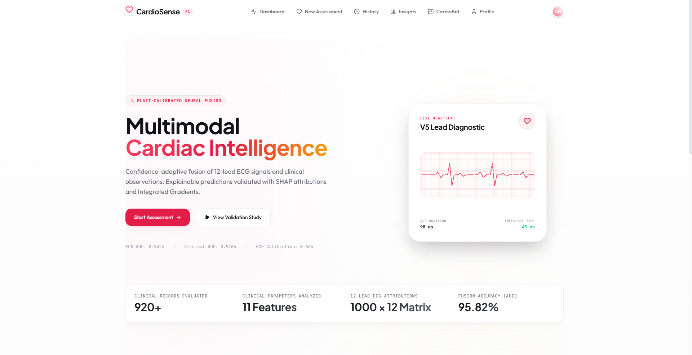
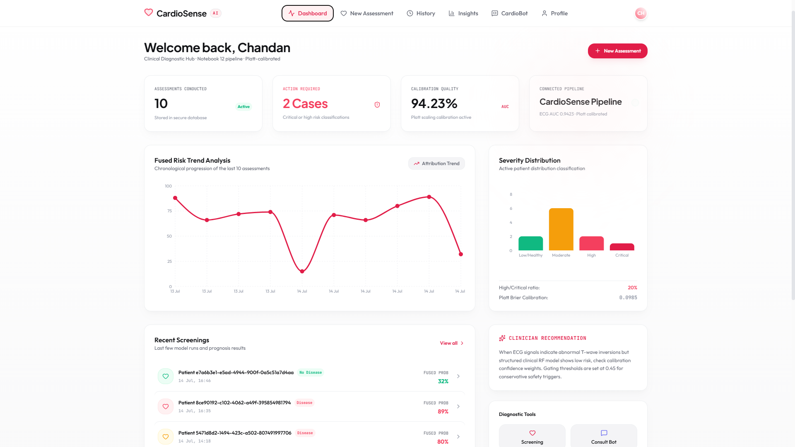
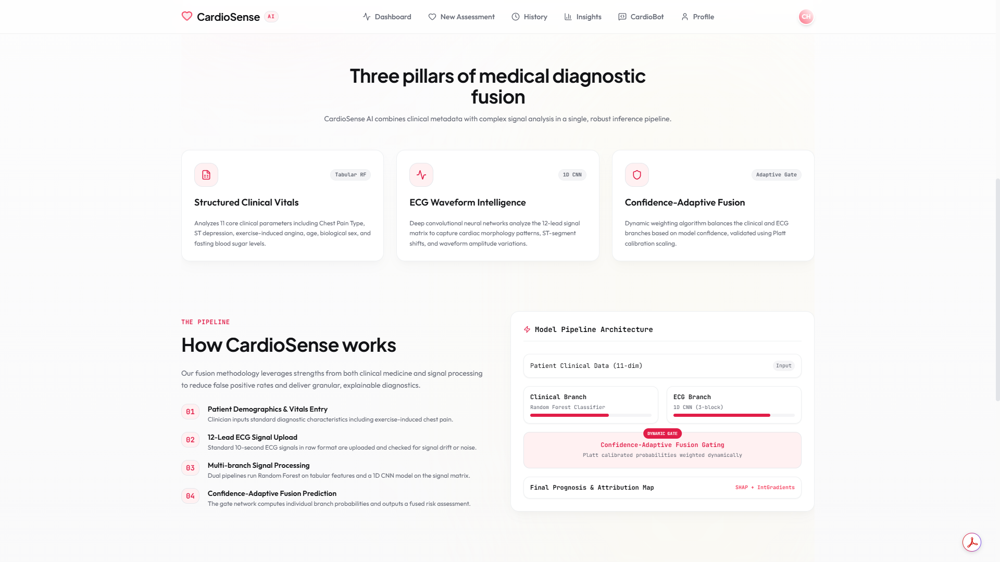
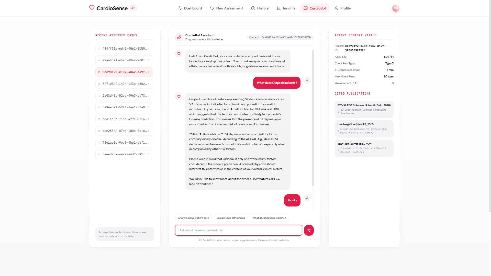
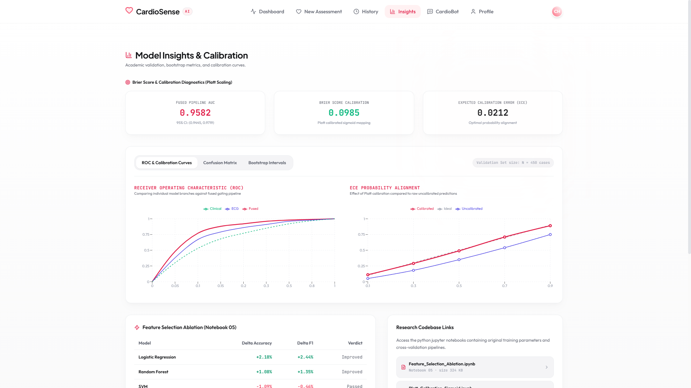
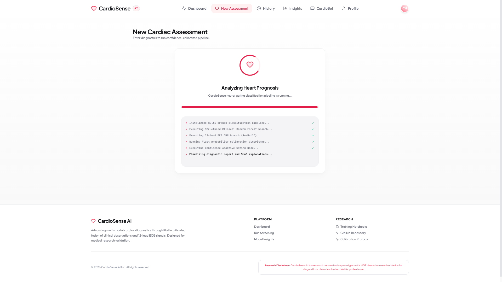
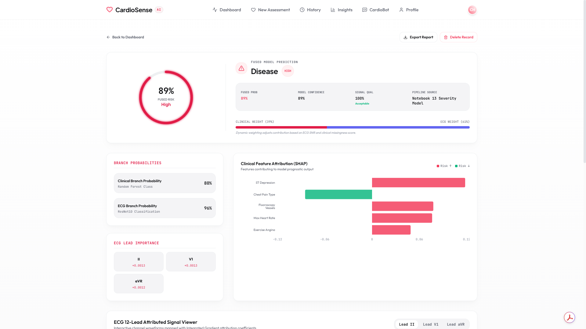

<div align="center">



# CardioSense AI

**Dual-branch cardiac risk assessment — ECG signal fusion meets clinical intelligence**

[](https://cardiosense-gamma.vercel.app/)
[](https://cardiosense-backend-7j16.onrender.com/docs)
[](./LICENSE)
[](https://nextjs.org)
[](https://fastapi.tiangolo.com)

</div>

---

## What this is

CardioSense AI is a research-grade full-stack application that fuses two independent diagnostic signals — a **1D-CNN ECG branch** trained on PTB-XL and a **Random Forest clinical branch** trained on UCI Heart Disease — into a single confidence-weighted risk assessment. Neither branch alone is the answer; the fusion model decides how much to trust each one depending on signal quality.

This is not a clinical tool. It is an end-to-end engineering demonstration of applied ML: calibrated probability outputs, confidence-gated decision fusion, real-time streaming inference, and an AI assistant that reasons over the full assessment context.

> **Deployed and live.** Backend on Render (FastAPI + Granian). Frontend on Vercel (Next.js 14). Database on Supabase PostgreSQL (ap-south-1).

---

## Demo

<div align="center">

[](https://github.com/user-attachments/assets/abda6b5e-2880-415a-99c4-598484f72176)

</div>

<div align="center">
<table>
<tr>
<td></td>
<td></td>
</tr>
<tr>
<td align="center"><sub>Dashboard — risk overview and recent assessments</sub></td>
<td align="center"><sub>Pipeline Architecture — multi-branch fusion workflow</sub></td>
</tr>
<tr>
<td></td>
<td></td>
</tr>
<tr>
<td align="center"><sub>CardioBot — context-aware cardiac AI assistant</sub></td>
<td align="center"><sub>Model comparison and calibration metrics</sub></td>
</tr>
<tr>
<td></td>
<td></td>
</tr>
<tr>
<td align="center"><sub>Animated 6-stage streaming pipeline</sub></td>
<td align="center"><sub>Prognosis Report — explainable SHAP metrics</sub></td>
</tr>
</table>
</div>

---

## Model performance

All metrics are on held-out test sets. Bootstrap CI at n=1000.

| Branch | AUC | 95% CI | Brier Score | ECE |
|---|---|---|---|---|
| ECG (CNN) | **0.9424** | 0.9347 – 0.9504 | 0.0943 | 0.034 |
| Clinical (RF) | **0.9266** | 0.8887 – 0.9582 | — | — |
| **Fused** | **0.9582** | 0.9445 – 0.9719 | — | — |

Clinical branch recall: **90.2%** — tuned to minimize false negatives, which matter more in cardiac risk screening than false positives.

**Key design decisions that earned these numbers:**

- `GroupShuffleSplit` on `patient_id` — prevents patient leakage between train and test in PTB-XL (multi-record patients)  
- Gamma=3 Platt scaling — aggressive calibration toward the positive class; ECE drops to 0.034  
- Missingness treated as an explicit feature — not imputed away, encoded as a signal in the clinical branch  
- CNN-only ECG architecture — CNN-LSTM evaluated in ablation, underperformed; dropped

---

## Architecture

```
┌─────────────────────────────────────────────────────────────────┐
│                        Next.js 14 Frontend                      │
│   Dashboard · New Assessment · History · Insights · CardioBot   │
└────────────────────────┬────────────────────────────────────────┘
                         │ HTTPS / SSE
┌────────────────────────▼────────────────────────────────────────┐
│                    FastAPI (Granian ASGI)                        │
│                                                                  │
│  POST /assess/run-stream  ──►  6-stage SSE pipeline             │
│  GET  /insights/*         ──►  model metrics, SHAP, calibration │
│  POST /cardiobot/chat     ──►  Groq (llama-3.1-8b-instant)      │
│                                                                  │
│  ┌────────────────────────────────────────────────────────┐     │
│  │                   ML Inference Layer                   │     │
│  │                                                        │     │
│  │   ECG Branch              Clinical Branch              │     │
│  │   ──────────              ───────────────              │     │
│  │   1D-CNN (TF/Keras)       Random Forest (sklearn)      │     │
│  │   PTB-XL (21,837 ECGs)    UCI Heart Disease            │     │
│  │   Raw signal → prob       11 features → prob           │     │
│  │          │                        │                    │     │
│  │          └────────┬───────────────┘                    │     │
│  │                   ▼                                    │     │
│  │        Confidence-Adaptive Fusion                      │     │
│  │        (gamma=3 Platt calibration)                     │     │
│  │                   │                                    │     │
│  │        SHAP explanations + risk grade                  │     │
│  └────────────────────────────────────────────────────────┘     │
│                                                                  │
│  SQLAlchemy 2.0 ──► Supabase PostgreSQL (ap-south-1)            │
└─────────────────────────────────────────────────────────────────┘
```

### Streaming inference — how the animated pipeline works

`POST /assess/run-stream` is a **Server-Sent Events endpoint**. It yields six tokens, each mapped to a named stage in the frontend's animated pipeline:

```
ECG_PROCESSING → CLINICAL_ANALYSIS → FEATURE_EXTRACTION
  → RISK_FUSION → CALIBRATION → ASSESSMENT_COMPLETE
```

The frontend advances the pipeline animation on each received token, then renders the full result from the final payload. This means the UI is never polling — it is reacting to real inference progress.

---

## Stack

| Layer | Technology |
|---|---|
| Frontend | Next.js 14 · TypeScript · Tailwind CSS · shadcn/ui · Recharts |
| Backend | FastAPI · Python 3.11 · Granian (ASGI) · Pydantic v2 |
| Database | PostgreSQL via Supabase · SQLAlchemy 2.0 · Alembic |
| ML — ECG | TensorFlow/Keras · 1D-CNN · PTB-XL |
| ML — Clinical | scikit-learn · Random Forest · UCI Heart Disease |
| ML — Explainability | SHAP · XGBoost (calibration) |
| AI Assistant | Groq API · llama-3.1-8b-instant |
| Deployment | Vercel (frontend) · Render (backend) |

---

## Features

**Assessment engine**
- Upload an ECG or enter clinical parameters — or both
- Confidence-adaptive fusion weights each branch dynamically
- SHAP feature importance breakdown per assessment
- Risk grade: Low / Moderate / High / Critical

**Streaming pipeline**
- Real-time 6-stage animated inference via SSE
- No polling — frontend reacts to actual backend events

**CardioBot**
- Context-aware AI assistant — every response is grounded in the current user's full assessment history from the database
- Not a generic chatbot; it knows what your last three assessments said
- Powered by Groq for sub-second first token latency

**Insights dashboard**
- Live model metrics: AUC curves, calibration plot, confusion matrix
- Bootstrap confidence intervals (n=1000) visualized
- Model comparison: ECG branch vs Clinical branch vs Fused

**History & audit**
- Full assessment history with detailed drill-down
- All inference results persisted to Supabase PostgreSQL

---

## Local development

**Prerequisites:** Node.js 18+, npm/yarn, a running instance of the [backend](https://github.com/cs-gitrp/cardiosense-backend)

```bash
git clone https://github.com/cs-gitrp/cardiosense-frontend
cd cardiosense-frontend
npm install
```

Create `.env.local`:

```env
NEXT_PUBLIC_API_URL=http://localhost:8000
```

```bash
npm run dev
# → http://localhost:3000
```

For the backend setup, see the [backend repository](https://github.com/cs-gitrp/cardiosense-backend).

---

## Repository structure

```
cardiosense-frontend/
│
├── assets/                       README screenshots and banner
│
├── src/
│   ├── app/                      Next.js App Router
│   │   ├── assess/               New assessment form + streaming pipeline UI
│   │   ├── auth/                 Login and registration
│   │   ├── cardiobot/            AI assistant interface
│   │   ├── dashboard/            Risk overview and recent assessments
│   │   ├── history/              Assessment history and detail views
│   │   ├── insights/             Model metrics, ROC curves, calibration visuals
│   │   ├── profile/              User profile
│   │   ├── results/              Assessment result detail
│   │   ├── layout.tsx            Root layout
│   │   ├── page.tsx              Landing page
│   │   ├── loading.tsx           Suspense loader
│   │   ├── not-found.tsx         404
│   │   └── globals.css
│   │
│   ├── components/
│   │   ├── charts/               Recharts wrappers (ROC, calibration, risk gauge)
│   │   ├── layout/               Navbar, sidebar, page shell
│   │   └── ui/                   shadcn/ui primitives
│   │
│   └── lib/                      API client, type definitions, utilities
│
├── next.config.mjs
├── tailwind.config.ts
├── components.json               shadcn/ui config
├── package.json
└── .env.local.example
```

---

## Related

| Repository | Description |
|---|---|
| [cardiosense-backend](https://github.com/cs-gitrp/cardiosense-backend) | FastAPI backend · ML inference · SSE streaming · Supabase |
| [cardiosense-notebooks](https://github.com/cs-gitrp/cardiosense-notebooks) | 13 Jupyter notebooks — full ML pipeline from raw data to deployed model |

---

## Honest limitations

- **Not a clinical tool.** Risk grades are probabilistic outputs from research datasets. Do not use for actual medical decisions.
- **Render cold starts.** The backend is on Render's free tier — first request after inactivity takes 30–60 seconds to wake up.
- **ECG input is simulated in demo.** The live demo uses a pre-digitized ECG vector; raw ECG image upload uses a digitization service that adds latency.
- **Clinical branch dataset size.** UCI Heart Disease is 303 records — the RF model's confidence intervals are wider than the ECG branch's for this reason.

---

## Author

**Chandan Singh** · B.Tech CSE (AI/ML), KCC Institute of Technology & Management  

[](https://linkedin.com/in/chandan-singh-a23563304)
[](https://github.com/cs-gitrp)
[](https://credly.com/users/chandan-singh.f55fc216)

---

<div align="center">
<sub>Built with real datasets, real calibration, and real bugs fixed at 2am.</sub>
</div>
